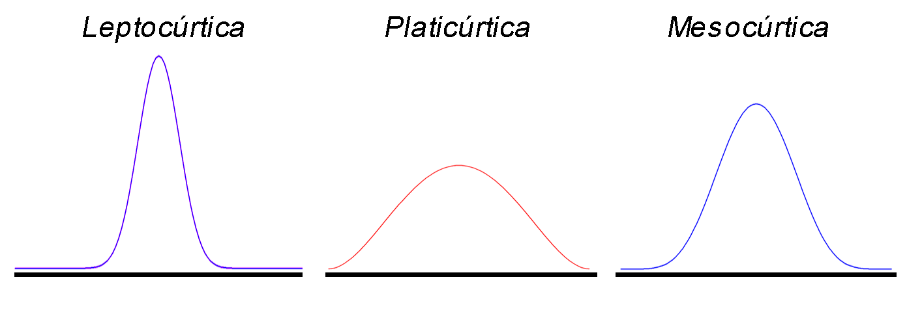
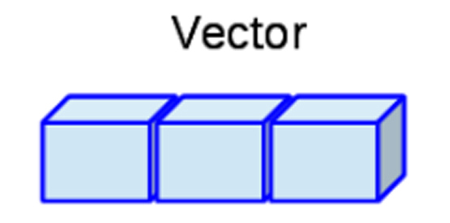
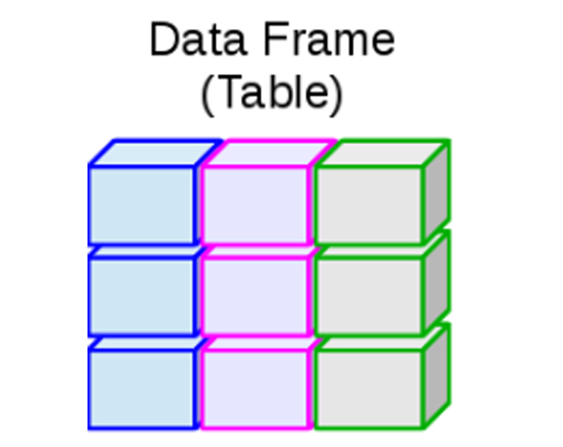
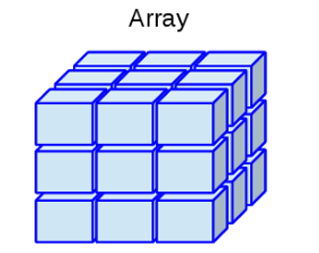

Medidas estadísticas
--------------------

#### Caso de estudio

Suponga que se está interesado en observar la evolución en el desempeño
que tuvo un grupo de `$10$` estudiantes en el curso de Estadística I.
Para ello se toma de referencia la nota obtenida en el primer y cuarto
parcial de la materia, obteniendo los siguientes resultados

<section style="overflow: auto; margin-top: -60px; margin-bottom: -90px;">
<table class="table table-striped" style="width: auto !important; margin-left: auto; margin-right: auto;">
<thead>
<tr>
<th style="text-align:left;">
</th>
<th style="text-align:right;">
1
</th>
<th style="text-align:right;">
2
</th>
<th style="text-align:right;">
3
</th>
<th style="text-align:right;">
4
</th>
<th style="text-align:right;">
5
</th>
<th style="text-align:right;">
6
</th>
<th style="text-align:right;">
7
</th>
<th style="text-align:right;">
8
</th>
<th style="text-align:right;">
9
</th>
<th style="text-align:right;">
10
</th>
</tr>
</thead>
<tbody>
<tr>
<td style="text-align:left;">
Parcial 1
</td>
<td style="text-align:right;">
2.7
</td>
<td style="text-align:right;">
4.0
</td>
<td style="text-align:right;">
3.1
</td>
<td style="text-align:right;">
2.7
</td>
<td style="text-align:right;">
2.9
</td>
<td style="text-align:right;">
1.3
</td>
<td style="text-align:right;">
2.6
</td>
<td style="text-align:right;">
2.8
</td>
<td style="text-align:right;">
3.3
</td>
<td style="text-align:right;">
2.1
</td>
</tr>
<tr>
<td style="text-align:left;">
Parcial 4
</td>
<td style="text-align:right;">
1.8
</td>
<td style="text-align:right;">
4.7
</td>
<td style="text-align:right;">
3.4
</td>
<td style="text-align:right;">
0.7
</td>
<td style="text-align:right;">
4.1
</td>
<td style="text-align:right;">
3.6
</td>
<td style="text-align:right;">
4.5
</td>
<td style="text-align:right;">
3.2
</td>
<td style="text-align:right;">
3.4
</td>
<td style="text-align:right;">
2.0
</td>
</tr>
</tbody>
</table>
</section>

### Medidas de dispersión

Estas medidas tienen por objetivo determinar la dispersión o
variabilidad que posee un conjunto de observaciones, en donde, entre
mayor sean estas medidas, mayor será el grado de dispersión de los
datos. Si se define `$x_1, x_2, \ldots, x_n$` como un conjunto de `$n$`
observaciones, entonces

#### Varianza

Mide la distancia media **al cuadrado** del conjunto de datos respecto a
la media
`\begin{align*}   S^2=\frac{1}{n-1}\sum_{i=1}^n{(x_i-\bar{X})^2} \end{align*}`
<!--el n-1 se conoce como corrección de Bessel, y se realiza para corregir el sesgo del estimador-->

En <tt>R</tt> puede calcularse la varianza de un conjunto de
observaciones mediante la función `var(datos)`.

#### Ejercicio caso de estudio

Calcule la varianza obtenida a partir de la nota de los `$10$`
estudiantes en el primer y cuarto parcial del curso de Estadísitica I,
de forma manual y en <tt>R</tt>.

<button id="Show1" class="btn btn-secondary">
Mostrar Solución Manual
</button>
<button id="Hide1" class="btn btn-info">
Ocultar Solución Manual
</button>
<main id="botoncito1">
<h3 data-toc-skip>
Solución manual
</h3>
<p>
La varianza de las notas obtenidas en los parciales \(1\) y \(4\) por
los estudiantes que cursaron Probabilidad e Inferencia Estadística
estará dada por
</p>
\[\begin{align*}S^2_{P1}=\frac{1}{10-1}\left[(2.7 - 2.75)^2 + (4.0 - 2.75)^2 + \ldots + (2.1 - 2.75) ^2\right] = 0.5072222 \\ S^2_{P4}=\frac{1}{10-1}\left[(1.8 - 3.14)^2 + (4.7 - 3.14)^2 + \ldots + (2.0 - 3.14) ^2\right] = 1.622667\end{align*}\]
<p>
Es de anotar, que la interpretación de la varianza no tiene mucho
sentido, debido a que la unidad de medición estará elevada al cuadrado,
así que en general, los valores calculados se usan para realizar el
cálculo de la desviación estándar.
</p>
</main>
<button id="Show2" class="btn btn-secondary">
Mostrar Solución en <tt>R</tt>
</button>
<button id="Hide2" class="btn btn-info">
Ocultar Solución en <tt>R</tt>
</button>
<main id="botoncito2">
<h3 data-toc-skip>
Solución en <tt>R</tt>
</h3>
<p>
Para realizar el cálculo de la varianza en <tt>R</tt>, para las nota
obtenida por los estudiantes en los dos parciales se emplea la función
<code>var()</code> tal que
</p>
<section class="language-r highlighter-rouge">
<section class="highlight">
<pre class="highlight"><code><span class="c1">## Se calcula la varianza de cada conjunto de datos</span><span class="w">
</span><span class="c1"># Varianza Parcial 1</span><span class="w">
</span><span class="n">var</span><span class="p">(</span><span class="n">P1</span><span class="p">)</span><span class="w">
</span></code></pre>
</section>
</section>
<section class="highlighter-rouge">
<section class="highlight">
<pre class="highlight"><code>[1] 0.5072222
</code></pre>
</section>
</section>
<section class="language-r highlighter-rouge">
<section class="highlight">
<pre class="highlight"><code><span class="c1"># Varianza Parcial 4</span><span class="w">
</span><span class="n">var</span><span class="p">(</span><span class="n">P4</span><span class="p">)</span><span class="w">
</span></code></pre>
</section>
</section>
<section class="highlighter-rouge">
<section class="highlight">
<pre class="highlight"><code>[1] 1.622667
</code></pre>
</section>
</section>
</main>

#### Desviación estándar

Es la raíz cuadrada de la distancia media del conjunto de datos respeto
a la media, es decir, indica qué tan dispersos se encuentra el conjunto
de observaciones de su valor promedio.
`\begin{align*}   S=\sqrt{S^2} \end{align*}`

En <tt>R</tt> puede calcularse la desviación estándar de un conjunto de
observaciones mediante la función `sd(datos)`.

#### Ejercicio caso de estudio

Calcule la desviación estándar de la nota de los `$10$` estudiantes en
el primer y cuarto parcial del curso de Estadísitica I, de forma manual
y en <tt>R</tt>.

<button id="Show3" class="btn btn-secondary">
Mostrar Solución Manual
</button>
<button id="Hide3" class="btn btn-info">
Ocultar Solución Manual
</button>
<main id="botoncito3">
<h3 data-toc-skip>
Solución manual
</h3>
<p>
La desviación estándar de las notas obtenidas en los parciales \(1\) y
\(4\) por los estudiantes que cursaron Probabilidad e Inferencia
Estadística, es simplemente la raíz cuadrada de la varianza que se
calculó anteriormente, y por tanto se tendrá que
</p>
\[\begin{align*}S_{P1}=\sqrt{0.5072222} = 0.7121953 \\ S_{P4}=\sqrt{1.622667} = 1.273839\end{align*}\]
<p>
De los resultados obtenidos se tiene que, la dispersión que poseen los
datos respecto a su valor promedio es de \(0.7121953\) para las notas
obtenidas en el parcial \(1\) y de \(1.273839\) para las notas obtenidas
en el parcial \(4\) de Probabilidad e Inferencia Estadística. Esto
quiere decir, que las notas obtenidas en el parcial \(1\) se encuentran
más reunidas respecto a valor promedio, que las notas obtenidas en el
parcial \(4\).
</p>
</main>
<button id="Show4" class="btn btn-secondary">
Mostrar Solución en <tt>R</tt>
</button>
<button id="Hide4" class="btn btn-info">
Ocultar Solución en <tt>R</tt>
</button>
<main id="botoncito4">
<h3 data-toc-skip>
Solución en <tt>R</tt>
</h3>
<p>
Para realizar el cálculo de las desviaciones estándar para las nota
obtenida por los estudiantes en los dos parciales en el programa
<tt>R</tt>, se emplea la función <code>sd()</code> tal que
</p>
<section class="language-r highlighter-rouge">
<section class="highlight">
<pre class="highlight"><code><span class="c1">## Se calcula la desviación estándar de cada conjunto de datos</span><span class="w">
</span><span class="c1"># Desviación estándar Parcial 1</span><span class="w">
</span><span class="n">sd</span><span class="p">(</span><span class="n">P1</span><span class="p">)</span><span class="w">
</span></code></pre>
</section>
</section>
<section class="highlighter-rouge">
<section class="highlight">
<pre class="highlight"><code>[1] 0.7121954
</code></pre>
</section>
</section>
<section class="language-r highlighter-rouge">
<section class="highlight">
<pre class="highlight"><code><span class="c1"># Desviación estándar Parcial 4</span><span class="w">
</span><span class="n">sd</span><span class="p">(</span><span class="n">P4</span><span class="p">)</span><span class="w">
</span></code></pre>
</section>
</section>
<section class="highlighter-rouge">
<section class="highlight">
<pre class="highlight"><code>[1] 1.273839
</code></pre>
</section>
</section>
</main>

#### Coeficiente de variación

Es la desviación estándar como un porcentaje de la media aritmética de
un conjunto de datos. Sirve para observar el grado de variabilidad que
tiene un conjunto de observaciones respecto a su promedio
`\begin{align*}   CV = \frac{S}{|\bar{X}|} \times 100\% \end{align*}`

Entre las funciones base del programa <tt>R</tt> no hay ninguna función
que calcule el coeficiente de variación de un conjunto de observaciones,
pero éste es fácil de calcular mediante el cociente entre la desviación
estándar `$S$` y el valor absoluto de la media `$\bar{X}$`, o creando
una función que realice el cálculo, de la forma

``` r
# Función para el cálculo del coeficiente de variación
CV <- function(x) (sd(x)/abs(mean(x))) * 100
```

Una vez creada la función, puede calcularse el coeficiente de variación
de un conjunto de observaciones mediante la función `CV(datos)`.

#### Ejercicio caso de estudio

Calcule el porcentaje de variación de la nota de los `$10$` estudiantes
en el primer y cuarto parcial del curso de Estadísitica I, respecto a su
valor promedio, de forma manual y en <tt>R</tt>.

<button id="Show5" class="btn btn-secondary">
Mostrar Solución Manual
</button>
<button id="Hide5" class="btn btn-info">
Ocultar Solución Manual
</button>
<main id="botoncito5">
<h3 data-toc-skip>
Solución manual
</h3>
<p>
El coeficiente de variación refleja la variación porcentual que tiene un
conjunto de observaciones respecto a su valor promedio, por tanto, al
aplicar la ecuación del coeficiente de variación a las notas obtenidas
en los parciales \(1\) y \(4\) por los estudiantes que cursaron
Probabilidad e Inferencia Estadística, se tiene que
</p>
\[\begin{align*}CV_{P1}= \frac{0.7121953}{|2.75|} \times 100\% = 25.89801 \% \\ CV_{P4}= \frac{1.273839}{|3.14|} \times 100\% = 40.56812 \%\end{align*}\]
<p>
De lo anterior, se aprecia que tal como se esperaba, la variación
porcentual de los datos respecto a su media para el caso del parcial
\(1\) es menor al obtenido en el parcial \(4\), pues se evidencia que el
coeficiente de variación del parcial \(1\) es cercano al \(25.9\%\),
mientras que en el parcial \(4\), se obtuvo un porcentaje de variación
de \(40.57\%\).
</p>
</main>
<button id="Show6" class="btn btn-secondary">
Mostrar Solución en <tt>R</tt>
</button>
<button id="Hide6" class="btn btn-info">
Ocultar Solución en <tt>R</tt>
</button>
<main id="botoncito6">
<h3 data-toc-skip>
Solución en <tt>R</tt>
</h3>
<p>
Para realizar el cálculo en el programa <tt>R</tt> de los coeficientes
de variación, para las nota obtenida por los estudiantes en el primer y
cuarto parcial de Estadística 1, se emplea la función <code>CV()</code>
planteada anteriormente. tal que
</p>
<section class="language-r highlighter-rouge">
<section class="highlight">
<pre class="highlight"><code><span class="c1"># Se corre inicialmente la función CV para crearla</span><span class="w">
</span><span class="n">CV</span><span class="w"> </span><span class="o">&lt;-</span><span class="w"> </span><span class="k">function</span><span class="p">(</span><span class="n">x</span><span class="p">)</span><span class="w"> </span><span class="p">(</span><span class="n">sd</span><span class="p">(</span><span class="n">x</span><span class="p">)</span><span class="o">/</span><span class="nf">abs</span><span class="p">(</span><span class="n">mean</span><span class="p">(</span><span class="n">x</span><span class="p">)))</span><span class="w"> </span><span class="o">*</span><span class="w"> </span><span class="m">100</span><span class="w">

</span><span class="c1">## Se calcula el coeficiente de variación de cada conjunto de datos</span><span class="w">
</span><span class="c1">## Coeficiente de variación Parcial 1</span><span class="w">
</span><span class="n">CV</span><span class="p">(</span><span class="n">P1</span><span class="p">)</span><span class="w">
</span></code></pre>
</section>
</section>
<section class="highlighter-rouge">
<section class="highlight">
<pre class="highlight"><code>[1] 25.89801
</code></pre>
</section>
</section>
<section class="language-r highlighter-rouge">
<section class="highlight">
<pre class="highlight"><code><span class="c1"># Coeficiente de variación Parcial 4</span><span class="w">
</span><span class="n">CV</span><span class="p">(</span><span class="n">P4</span><span class="p">)</span><span class="w">
</span></code></pre>
</section>
</section>
<section class="highlighter-rouge">
<section class="highlight">
<pre class="highlight"><code>[1] 40.56813
</code></pre>
</section>
</section>
</main>

#### Rango

Es la distancia o amplitud que hay entre el valor máximo y mínimo en un
conjunto de datos `\begin{align*}   R = x_{max}-x_{min} \end{align*}`

Entre las funciones base del programa <tt>R</tt> no hay ninguna función
que calcule el rango de un conjunto de observaciones de forma directa,,
pero éste es fácil de calcular mediante la resta del valor máximo
`max(datos)` y mínimo `min(datos)`, o creando una función que realice el
cálculo, de la forma

``` r
# Función para el cálculo del rango
Rango <- function(x) max(x) - min(x)
```

Una vez creada la función, puede calcularse el rango de un conjunto de
observaciones mediante la función `Rango(datos)`. Una forma alternativa
para realizar el cálculo del rango de un conjunto de observaciones, es
empleando una combinaciones de funciones de la forma
`diff(range(datos))`.

#### Ejercicio caso de estudio

Calcule el rango para las notas obtenidas en el primer y cuarto parcial
por los `$10$` estudiantes del curso de Probabilidad e Inferencia
Estadística, de forma manual y en <tt>R</tt>.

<button id="Show7" class="btn btn-secondary">
Mostrar Solución Manual
</button>
<button id="Hide7" class="btn btn-info">
Ocultar Solución Manual
</button>
<main id="botoncito7">
<h3 data-toc-skip>
Solución manual
</h3>
<p>
Para realizar el cálculo del rango o amplitud que poseen las notas
obtenidas por los estudiantes que vieron el curso de Probabilidad e
Inferencia Estadística en los parciales \(1\) y \(4\), es necesario
inicialmente ordenar las notas en orden ascendente, tal que
</p>
<section style="overflow: auto; margin-top: -60px; margin-bottom: -30px;">
<table class="table table-striped" style="width: auto !important; margin-left: auto; margin-right: auto;">
<tbody>
<tr>
<td style="text-align:right;">
Parcial 1
</td>
<td style="text-align:right;">
<span
style="     border-radius: 4px; padding-right: 4px; padding-left: 4px; background-color: #974c55 !important;">1.3</span>
</td>
<td style="text-align:right;">
2.1
</td>
<td style="text-align:right;">
2.6
</td>
<td style="text-align:right;">
2.7
</td>
<td style="text-align:right;">
2.7
</td>
<td style="text-align:right;">
2.8
</td>
<td style="text-align:right;">
2.9
</td>
<td style="text-align:right;">
3.1
</td>
<td style="text-align:right;">
3.3
</td>
<td style="text-align:right;">
<span
style="     border-radius: 4px; padding-right: 4px; padding-left: 4px; background-color: #974c55 !important;">4.0</span>
</td>
</tr>
</tbody>
</table>
</section>
<section style="overflow: auto; margin-top: -60px; margin-bottom: -30px;">
<table class="table table-striped" style="width: auto !important; margin-left: auto; margin-right: auto;">
<tbody>
<tr>
<td style="text-align:right;">
Parcial 4
</td>
<td style="text-align:right;">
<span
style="     border-radius: 4px; padding-right: 4px; padding-left: 4px; background-color: #974c55 !important;">0.7</span>
</td>
<td style="text-align:right;">
1.8
</td>
<td style="text-align:right;">
2.0
</td>
<td style="text-align:right;">
3.2
</td>
<td style="text-align:right;">
3.4
</td>
<td style="text-align:right;">
3.4
</td>
<td style="text-align:right;">
3.6
</td>
<td style="text-align:right;">
4.1
</td>
<td style="text-align:right;">
4.5
</td>
<td style="text-align:right;">
<span
style="     border-radius: 4px; padding-right: 4px; padding-left: 4px; background-color: #974c55 !important;">4.7</span>
</td>
</tr>
</tbody>
</table>
</section>
<p>
Una vez ordenados los valores, se localiza el valor máximo y mínimo de
cada parcial, y se realiza entonces el cálculo del rango para cada caso
</p>
\[\begin{align*}R_{P1}= 4.0 - 1.3 = 2.7 \\ R_{P4}= 4.7 - 0.7 = 4.0\end{align*}\]
<p>
Se evidencia entonces que la amplitud de las notas del parcial \(4\) es
mucho mayor a la amplitud del parcial \(1\), puesto que se observa que
el rango obtenido por las notas del parcial \(4\) es de \(4.0\) puntos,
mientras que el rango obtenido por las notas del parcial \(1\) es de
\(2.7\) puntos. De lo anterior, vemos que hay una consistencia con lo
encontrado en la desviación estándar, en donde veíamos que la dispersión
para el parcial \(4\) era mayor a la dispersión del parcial \(1\).
</p>
</main>
<button id="Show8" class="btn btn-secondary">
Mostrar Solución en <tt>R</tt>
</button>
<button id="Hide8" class="btn btn-info">
Ocultar Solución en <tt>R</tt>
</button>
<main id="botoncito8">
<h3 data-toc-skip>
Solución en <tt>R</tt>
</h3>
<p>
Para realizar el cálculo en <tt>R</tt> del rango de las notas obtenidas
en el primer y cuarto parcial por los estudiantes de Estadística 1, se
emplea la función <code>Rango()</code> planteada anteriormente, tal que
</p>
<section class="language-r highlighter-rouge">
<section class="highlight">
<pre class="highlight"><code><span class="c1"># Se corre inicialmente la función Rango para crearla</span><span class="w">
</span><span class="n">Rango</span><span class="w"> </span><span class="o">&lt;-</span><span class="w"> </span><span class="k">function</span><span class="p">(</span><span class="n">x</span><span class="p">)</span><span class="w"> </span><span class="nf">max</span><span class="p">(</span><span class="n">x</span><span class="p">)</span><span class="w"> </span><span class="o">-</span><span class="w"> </span><span class="nf">min</span><span class="p">(</span><span class="n">x</span><span class="p">)</span><span class="w">

</span><span class="c1">## Se calcula el coeficiente de variación de cada conjunto de datos Rango</span><span class="w">
</span><span class="c1">## Parcial 1</span><span class="w">
</span><span class="n">Rango</span><span class="p">(</span><span class="n">P1</span><span class="p">)</span><span class="w">
</span></code></pre>
</section>
</section>
<section class="highlighter-rouge">
<section class="highlight">
<pre class="highlight"><code>[1] 2.7
</code></pre>
</section>
</section>
<section class="language-r highlighter-rouge">
<section class="highlight">
<pre class="highlight"><code><span class="c1">## Rango Parcial 4</span><span class="w">
</span><span class="n">Rango</span><span class="p">(</span><span class="n">P4</span><span class="p">)</span><span class="w">
</span></code></pre>
</section>
</section>
<section class="highlighter-rouge">
<section class="highlight">
<pre class="highlight"><code>[1] 4.0
</code></pre>
</section>
</section>
</main>

#### Rango intercuartílico

Es la distancia o amplitud que hay entre el tercer cuartil `$C_3$` y el
primer cuartil `$C_1$`, de un conjunto de datos. Éste muestra la
amplitud del 50% de los datos centrales de un conjunto de observaciones.
Esta medida puede ser tomada como una medida de variabilidad para la
mediana. `\begin{align*}   IQR = C_3 - C_1 \end{align*}`

En <tt>R</tt> puede calcularse el rango intercuartílico de un conjunto
de observaciones mediante la función `IQR(datos)`.

#### Ejercicio caso de estudio

Calcule el rango intercuarílico para las notas obtenidas en el primer y
cuarto parcial por los `$10$` estudiantes del curso de Probabilidad e
Inferencia Estadística, de forma manual y en <tt>R</tt>.

<button id="Show9" class="btn btn-secondary">
Mostrar Solución Manual
</button>
<button id="Hide9" class="btn btn-info">
Ocultar Solución Manual
</button>
<main id="botoncito9">
<h3 data-toc-skip>
Solución manual
</h3>
<p>

El rango intercuartílico se calcula de forma similar al rango, solo que
en lugar de emplear el valor máximo y el valor mínimo del conjunto de
observaciones, se emplea en su lugar, el tercer y primer cuartil. <br>

Entonces, basados en los cálculos de los cuartiles obtenidos en la
<a href="https://jouninlrmd.github.io/ProbabilidadeInferencia/PeIEClase03.html#cuartil" target="\_blank">Clase
1</a> (ver Solucion en R), se tendrá que el primer y tercer cuartil para
el parcial \(1\) son \(C_{1}= 2.625\) y \(C_{3}= 3.050\),
respectivamente, obteniendo un rango intercuartílico de
</p>
\[\begin{align*}IQR_{P1}= 3.050 - 2.625 = 0.425\end{align*}\]
<p>
mientras que, el primer y tercer cuartil para el parcial \(4\) son
\(C_{1}= 2.3\) y \(C_{3}= 3.975\), respectivamente, y en consecuencia,
el rango intercuartílico asociado al parciarl \(4\) será
</p>
\[\begin{align*}IQR_{P4}= 3.975 - 2.3 = 1.675\end{align*}\]
<p>
Mostrando que, al eliminar el \(50\%\) de los datos más extremos, se
obtiene un rango de \(0.425\) para el caso del parcial \(1\), y de
\(1.675\) para el caso del parcial \(4\), lo cual, corrobora que aún
para el \(50\%\) de los datos centrales, se aprecia que la dispersión de
las notas del primer parcial es bastante menor que la dispersión de las
notas del cuarto parcial.
</p>
</main>
<button id="Show10" class="btn btn-secondary">
Mostrar Solución en <tt>R</tt>
</button>
<button id="Hide10" class="btn btn-info">
Ocultar Solución en <tt>R</tt>
</button>
<main id="botoncito10">
<h3 data-toc-skip>
Solución en <tt>R</tt>
</h3>
<p>
Para realizar el cálculo del rango intercuartílico en <tt>R</tt> de las
notas obtenidas en el primer y cuarto parcial por los estudiantes de
Estadística 1, se emplea la función <code>IQR()</code>, tal que
</p>
<section class="language-r highlighter-rouge">
<section class="highlight">
<pre class="highlight"><code><span class="c1">## Se calcula el rango intercuartílico de cada conjunto de datos</span><span class="w">
</span><span class="c1"># Rango intercuarílico Parcial 1</span><span class="w">
</span><span class="n">IQR</span><span class="p">(</span><span class="n">P1</span><span class="p">)</span><span class="w">
</span></code></pre>
</section>
</section>
<section class="highlighter-rouge">
<section class="highlight">
<pre class="highlight"><code>[1] 0.425
</code></pre>
</section>
</section>
<section class="language-r highlighter-rouge">
<section class="highlight">
<pre class="highlight"><code><span class="c1"># Rango intercuartílico Parcial 4</span><span class="w">
</span><span class="n">IQR</span><span class="p">(</span><span class="n">P4</span><span class="p">)</span><span class="w">
</span></code></pre>
</section>
</section>
<section class="highlighter-rouge">
<section class="highlight">
<pre class="highlight"><code>[1] 1.675
</code></pre>
</section>
</section>
</main>

#### Desviación absoluta mediana

Es una medida de la dispersión de un conjunto de observaciones respecto
a su mediana

`\begin{align*}   MAD=b\times Me(|X_i-\tilde{X}|) \end{align*}`

donde `$b$` es una constante definida como `$b=1/C_{3}$`, con `$C_{3}$`
el valor del tercer cuartil de la distribución de interés (no el
obtenido de los datos) y con `$Me(|X_i-\tilde{X}|)$` la mediana del
valor absoluto de la diferencia `$X_i-\tilde{X}$`. Además, si la
distribución es normal, entonces `$b\approx1.4826$`.

En <tt>R</tt> puede calcularse la desviación absoluta mediana de un
conjunto de observaciones, asumiendo que la distribución es normal,
mediante la función `mad(datos)`, si no es posible asumir que la
distribución es normal, entonces puede calcularse mediante la función
`mad(datos, constant = b)`.

#### Ejercicio caso de estudio

Calcule la desviación absoluta mediana de las notas obtenidas por los
`$10$` estudiantes, en el primer y cuarto parcial del curso de
Probabilidad e Inferencia Estadística, de forma manual y en <tt>R</tt>.

<button id="Show11" class="btn btn-secondary">
Mostrar Solución Manual
</button>
<button id="Hide11" class="btn btn-info">
Ocultar Solución Manual
</button>
<main id="botoncito11">
<h3 data-toc-skip>
Solución manual
</h3>
<p>
Para realizar el cálculo de la desviación absoluta mediana para las
notas obtenidas por los estudiantes en los parciales \(1\) y \(4\) del
curso de Probabilidad e Inferencia Estadística, es necesario
inicialmente realizar el cálculo de \(|X_i-\tilde{X}|\) para cada una de
las notas obtenidas en los dos parciales, siendo \(\tilde{X}\) el valor
de la mediana calculada en la
<a href="https://jouninlrmd.github.io/ProbabilidadeInferencia/PeIEClase03.html#mediana" target="\_blank">Clase
1</a> (ver Solucion manual o en R).
</p>
<section style="overflow: auto; margin-top: -60px; margin-bottom: -30px;">
<table class="table table-striped" style="width: auto !important; margin-left: auto; margin-right: auto;">
<thead>
<tr>
<th style="text-align:left;">
</th>
<th style="text-align:right;">
1
</th>
<th style="text-align:right;">
2
</th>
<th style="text-align:right;">
3
</th>
<th style="text-align:right;">
4
</th>
<th style="text-align:right;">
5
</th>
<th style="text-align:right;">
6
</th>
<th style="text-align:right;">
7
</th>
<th style="text-align:right;">
8
</th>
<th style="text-align:right;">
9
</th>
<th style="text-align:right;">
10
</th>
</tr>
</thead>
<tbody>
<tr>
<td style="text-align:left;">
Parcial 1 \(|X_i-\tilde{X}|\)
</td>
<td style="text-align:right;">
0.05
</td>
<td style="text-align:right;">
1.25
</td>
<td style="text-align:right;">
0.35
</td>
<td style="text-align:right;">
0.05
</td>
<td style="text-align:right;">
0.15
</td>
<td style="text-align:right;">
1.45
</td>
<td style="text-align:right;">
0.15
</td>
<td style="text-align:right;">
0.05
</td>
<td style="text-align:right;">
0.55
</td>
<td style="text-align:right;">
0.65
</td>
</tr>
<tr>
<td style="text-align:left;">
Parcial 4 \(|X_i-\tilde{X}|\)
</td>
<td style="text-align:right;">
1.60
</td>
<td style="text-align:right;">
1.30
</td>
<td style="text-align:right;">
0.00
</td>
<td style="text-align:right;">
2.70
</td>
<td style="text-align:right;">
0.70
</td>
<td style="text-align:right;">
0.20
</td>
<td style="text-align:right;">
1.10
</td>
<td style="text-align:right;">
0.20
</td>
<td style="text-align:right;">
0.00
</td>
<td style="text-align:right;">
1.40
</td>
</tr>
</tbody>
</table>
</section>
<p>
Seguidamente, se realiza el cálculo de la mediana de los valores
obtenidos en la tabla anterior, en donde, dado que se tienen \(10\)
observaciones, entonces \(Me(|X_i-\tilde{X}|)\) para el parcial \(1\)
será (recuerde que para encontrar la mediana es necesario ordenar las
observaciones de forma ascendente)
</p>

\[\begin{align*}Me(|X_i-\tilde{X}|) = \frac{1}{2}(0.15 + 0.35)= 0.25\end{align*}\]

<p>
mientras que, el valor \(Me(|X_i-\tilde{X}|)\) para el parcial \(4\)
será
</p>
\[\begin{align*}Me(|X_i-\tilde{X}|) = \frac{1}{2}(0.7 + 1.1)= 0.9\end{align*}\]
<p>
Ahora, al emplear estos dos valores, y asumiento que \(b=1.4826\), se
tendrá que la desviación absoluta mediana para los parciales \(1\) y
\(4\) son de
</p>
\[\begin{align*}MAD_{P1}= 1.4826 \times 0.25 = 0.37065 \\ MAD_{P4}= 1.4826 \times 0.9 = 1.33434\end{align*}\]
<p>
Se tiene entonces que la desviación abosulta mediana o dispersión
respecto a la mediana que poseen las notas de los estudiantes de
Probabilidad e Inferencia Estadística, en el primer parcial es de
\(0.37\), mientras para el cuarto parcial es de \(1.33434\), lo cual
indica que la dispersión de las notas para el cuarto parcial es superior
a la dispersión de las notas asociada al primer parcial, lo cual es
consistente con las otras medidas de dispersión vistas en esta sección.
</p>
</main>
<button id="Show12" class="btn btn-secondary">
Mostrar Solución en <tt>R</tt>
</button>
<button id="Hide12" class="btn btn-info">
Ocultar Solución en <tt>R</tt>
</button>
<main id="botoncito12">
<h3 data-toc-skip>
Solución en <tt>R</tt>
</h3>
<p>
Para realizar el cálculo de la desviación absoluta mediana en
<tt>R</tt>, para las notas obtenidas en el primer y cuarto parcial por
los estudiantes de Estadística 1, se emplea la función
<code>mad()</code>, de forma que
</p>
<section class="language-r highlighter-rouge">
<section class="highlight">
<pre class="highlight"><code><span class="c1">## Se calcula la desviación absoluta mediana de cada conjunto de datos</span><span class="w">
</span><span class="c1"># Desviación absoluta mediana Parcial 1</span><span class="w">
</span><span class="n">mad</span><span class="p">(</span><span class="n">P1</span><span class="p">)</span><span class="w">
</span></code></pre>
</section>
</section>
<section class="highlighter-rouge">
<section class="highlight">
<pre class="highlight"><code>[1] 0.37065
</code></pre>
</section>
</section>
<section class="language-r highlighter-rouge">
<section class="highlight">
<pre class="highlight"><code><span class="c1"># Desviación absoluta mediana Parcial 4</span><span class="w">
</span><span class="n">mad</span><span class="p">(</span><span class="n">P4</span><span class="p">)</span><span class="w">
</span></code></pre>
</section>
</section>
<section class="highlighter-rouge">
<section class="highlight">
<pre class="highlight"><code>[1] 1.33434
</code></pre>
</section>
</section>
</main>

### Medidas de forma

Estas medidas tienen por objetivo evidenciar si el conjunto de
observaciones tiene o no una forma simétrica y observar su nivel de
concentración.

#### Coeficiente de asimetría

Este valor permite identificar si el conjunto de datos se distribuye
uniformemente alrededor de las medidas de tendencia central.
`\begin{align*}   \gamma_1 = \frac{1}{n}\frac{\sum_{i=1}^n{(x_i-\bar{X})^3}}{S^3} \quad \quad -\infty<\gamma_1<\infty \end{align*}`
El signo de `$\gamma_1$` indica la dirección de la asimetría.

-   `$\gamma_1>0$` indica asimetría positiva, es decir, las
    observaciones se reúnen más en la parte izquierda de las medidas de
    tendencia central.
-   `$\gamma_1<0$` indica asimetría negativa, es decir, las
    observaciones se reúnen más en la parte derecha de las medidas de
    tendencia central.
-   `$\gamma_1\sim0$` indica simetría, es decir, existe aproximadamente
    la misma cantidad de observaciones a los dos lados de las medidas de
    tendencia central.

<h4 align="center">
Representación tipos de Asimetría
</h4>


Entre las funciones base del programa <tt>R</tt> no hay ninguna función
que calcule el coeficiente de asimetría de un conjunto de observaciones,
pero es posible realizar el cálculo mediante la función
`skewness(datos)` de la librería `e1071`.

#### Ejercicio caso de estudio

Calcule el coeficiente de asimetría de las notas obtenidas por los
`$10$` estudiantes, en el primer y cuarto parcial del curso de
Probabilidad e Inferencia Estadística, de forma manual y en <tt>R</tt>.

<button id="Show13" class="btn btn-secondary">
Mostrar Solución Manual
</button>
<button id="Hide13" class="btn btn-info">
Ocultar Solución Manual
</button>
<main id="botoncito13">
<h3 data-toc-skip>
Solución manual
</h3>
<p>
El coeficiente de asimetría asociado a la nota de los estudiantes del
curso de Probabilidad e Inferencia Estadística, para los parciales \(1\)
y \(4\), depende del valor promedio \(\bar{X}\) y la desviación estándar
\(S\). Por tanto al emplear los valores ya calculados en
<a href="https://jouninlrmd.github.io/ProbabilidadeInferencia/PeIEClase03.html#media" target="\_blank">Clase
1</a> y
<a href="https://jouninlrmd.github.io/ProbabilidadeInferencia/PeIEClase04.html#desviación-estándar" target="\_blank">Clase
2</a> (ver Solucion manual o en R), se tendrá que el coeficiente de
asimetría para los dos parciales estará dado por
</p>
\[\begin{align*}\gamma_{1,P_1} = \frac{1}{10}\left[\frac{(2.7 - 2.75)^3 + (4.0 - 2.75)^3 + \ldots + (2.1 - 2.75)^3}{0.7121954^3}\right] = -0.3213918 \\ \gamma_{1,P_4} = \frac{1}{10}\left[\frac{(1.8 - 3.14)^3 + (4.7 - 3.14)^3 + \ldots + (2.0 - 3.14)^3}{1.273839^3}\right] = -0.536286\end{align*}\]
<p>

De lo anterior se observa que en ambos casos el coeficiente de asimetría
es menor que \(0\), lo cual significa que las notas obtenidas en los dos
parciales posee una asimetría negativa, es decir, las notas obtenidas
por los estudiantes se encuentran agrupadas en la parte derecha, y en
consecuencia, se tiene que algunos (pocos) estudiantes obtuvieros notas
muy bajaras, respecto al resto de sus compañeros. <br>

También puede corroborarse el comportamiento asimétrico negativo, al
observar los valores obtenidos por la media y la mediana, en donde para
ambos parciales, se aprecia que la media posee un valor más bajo que la
mediana.
</p>
</main>
<button id="Show14" class="btn btn-secondary">
Mostrar Solución en <tt>R</tt>
</button>
<button id="Hide14" class="btn btn-info">
Ocultar Solución en <tt>R</tt>
</button>
<main id="botoncito14">
<h3 data-toc-skip>
Solución en <tt>R</tt>
</h3>
<p>
Para realizar el cálculo del coeficiente de asimetría, para la nota
obtenida por los estudiantes de Probabilidad e Inferencia Estadística en
los los parciales \(1\) y \(4\), se emplea la función
<code>skewness()</code> de la librería <code>e1071</code> de <tt>R</tt>,
tal que
</p>
<section class="language-r highlighter-rouge">
<section class="highlight">
<pre class="highlight"><code><span class="c1">## Si no se tiene instalada la librería e1071, puede instalarse mediante</span><span class="w">
</span><span class="c1"># install.packages('e1071', dependencies = T)</span><span class="w">

</span><span class="c1"># Se carga la librería para el cálculo de la asimetría</span><span class="w">
</span><span class="n">library</span><span class="p">(</span><span class="n">e1071</span><span class="p">)</span><span class="w">

</span><span class="c1">## Se calcula el coeficiente de asimetría de cada conjunto de datos</span><span class="w">
</span><span class="c1"># Coeficiente de asimetría Parcial 1</span><span class="w">
</span><span class="n">skewness</span><span class="p">(</span><span class="n">P1</span><span class="p">)</span><span class="w">
</span></code></pre>
</section>
</section>
<section class="highlighter-rouge">
<section class="highlight">
<pre class="highlight"><code>[1] -0.3213918
</code></pre>
</section>
</section>
<section class="language-r highlighter-rouge">
<section class="highlight">
<pre class="highlight"><code><span class="c1"># Coeficiente de asimetría Parcial 4</span><span class="w">
</span><span class="n">skewness</span><span class="p">(</span><span class="n">P4</span><span class="p">)</span><span class="w">
</span></code></pre>
</section>
</section>
<section class="highlighter-rouge">
<section class="highlight">
<pre class="highlight"><code>[1] -0.536286
</code></pre>
</section>
</section>
</main>

#### Coeficiente de exceso de curtosis

Este valor permite observar el grado de concentración del conjunto de
datos
`\begin{align*}   \gamma_2 = \frac{1}{n}\frac{\sum_{i=1}^n{(x_i-\bar{X})^4}}{S^4}-3 \quad \quad -2<\gamma_2<\infty \end{align*}`

El signo de `$\gamma_2$` indica el nivel de concentración.

-   `$\gamma_2>0$` indica leptocurtosis, es decir, la forma de los datos
    es más en punta y posee colas menos anchas.
-   `$\gamma_2<0$` indica platicurtosis, es decir, la forma de los datos
    es más plana y posee colas más anchas.
-   `$\gamma_2\sim0$` indica mesocurtosis, es decir, tanto la punta como
    las colas son similares a la distribución normal.

<h4 align="center">
Representación tipos de kurtosis
</h4>



Entre las funciones base del programa <tt>R</tt> no hay ninguna función
que calcule el coeficiente de exceso de curtosis de un conjunto de
observaciones, pero es posible realizar el cálculo mediante la función
`kurtosis(datos)` de la librería `e1071`.

#### Ejercicio caso de estudio

Calcule el coeficiente de exceso de curtosis de las notas obtenidas por
los `$10$` estudiantes, en el primer y cuarto parcial del curso de
Probabilidad e Inferencia Estadística, de forma manual y en <tt>R</tt>.

<button id="Show15" class="btn btn-secondary">
Mostrar Solución Manual
</button>
<button id="Hide15" class="btn btn-info">
Ocultar Solución Manual
</button>
<main id="botoncito15">
<h3 data-toc-skip>
Solución manual
</h3>
<p>
Similar al coeficiente de asimetría, el coeficiente de exceso de
curtosis depende del valor promedio \(\bar{X}\) y la desviación estándar
\(S\), de los parciales \(1\) y \(4\) del curso de Probabilidad e
Inferencia Estadística. Por tanto al emplear los valores ya calculados
en
<a href="https://jouninlrmd.github.io/ProbabilidadeInferencia/PeIEClase03.html#media" target="\_blank">Clase
1</a> y
<a href="https://jouninlrmd.github.io/ProbabilidadeInferencia/PeIEClase04.html#desviación-estándar" target="\_blank">Clase
2</a> (ver Solucion manual o en R), se tendrá que el coeficiente de
exceso de curtosis para los dos parciales estará dado por
</p>
\[\begin{align*}\gamma_{2,P_1} = \frac{1}{10}\left[\frac{(2.7 - 2.75)^4 + (4.0 - 2.75)^4 + \ldots + (2.1 - 2.75)^4}{0.7121954^4}\right] - 3= -0.2216579 \\ \gamma_{2,P_4} = \frac{1}{10}\left[\frac{(1.8 - 3.14)^4 + (4.7 - 3.14)^4 + \ldots + (2.0 - 3.14)^4}{1.273839^4}\right] - 3= -1.078075\end{align*}\]
<p>
A partir de los valores calculados, se observa que en ambos casos, los
coeficientes de exceso de curtoris es menor que \(0\), y por tanto, se
puede concluir que las notas de los estudiantes posee un comportamiento
platicúrtico, es decir, las notas obtenidas por los estudiantes en el
curso de Probabilidad e Inferencia Estadística, poseen un comportamiento
relativamente uniforme, debido a que su comportamiento es muy plano.
</p>
</main>
<button id="Show16" class="btn btn-secondary">
Mostrar Solución en <tt>R</tt>
</button>
<button id="Hide16" class="btn btn-info">
Ocultar Solución en <tt>R</tt>
</button>
<main id="botoncito16">
<h3 data-toc-skip>
Solución en <tt>R</tt>
</h3>
<p>
Para realizar el cálculo del coeficiente de exceso de curtosis, para la
nota obtenida por los estudiantes de Probabilidad e Inferencia
Estadística en los los parciales \(1\) y \(4\), se emplea la función
<code>kurtosis()</code> de la librería <code>e1071</code> de <tt>R</tt>,
tal que
</p>
<section class="language-r highlighter-rouge">
<section class="highlight">
<pre class="highlight"><code><span class="c1">## Se calcula el coeficiente de exceso de curtosis de cada conjunto de datos</span><span class="w">
</span><span class="c1"># Coeficiente de exceso de curtosis Parcial 1</span><span class="w">
</span><span class="n">kurtosis</span><span class="p">(</span><span class="n">P1</span><span class="p">)</span><span class="w">
</span></code></pre>
</section>
</section>
<section class="highlighter-rouge">
<section class="highlight">
<pre class="highlight"><code>[1] -0.2216579
</code></pre>
</section>
</section>
<section class="language-r highlighter-rouge">
<section class="highlight">
<pre class="highlight"><code><span class="c1"># Coeficiente de exceso de curtosis Parcial 4</span><span class="w">
</span><span class="n">kurtosis</span><span class="p">(</span><span class="n">P4</span><span class="p">)</span><span class="w">
</span></code></pre>
</section>
</section>
<section class="highlighter-rouge">
<section class="highlight">
<pre class="highlight"><code>[1] -1.078075
</code></pre>
</section>
</section>
</main>

### Medidas de asociación

Estas medidas tienen por objetivo estimar la magnitud con la que dos
fenómenos se relacionan, en donde, entre mayor sean estas medidas, mayor
será el grado de asociación que tendrán las variables. Si se define
`$x_1, x_2, \ldots, x_n$` y `$y_1, y_2, \ldots, y_n$` como dos conjuntos
de `$n$` observaciones, entonces

#### Covarianza

Mide si existe o no dependencia lineal entre las variables, e indica el
grado de variación conjunta de dos variables respecto a sus medias
`\begin{align*}   S_{xy} = \frac{1}{n}\sum_{i=1}^n{(x_i-\bar{X})(y_i-\bar{Y})}  \end{align*}`

El signo de `$S_{xy}$` indica el tipo de dependencia lineal que hay
entre las variables.

-   `$S_{xy} > 0$` indica que hay dependencia lineal positiva entre las
    variables, es decir, cuando aumenta una variable, la otra también
    aumenta.
-   `$S_{xy} < 0$` indica que hay dependencia lineal negativa entre las
    variables, es decir, cuando aumenta una variable, la otra disminuye.
-   `$S_{xy} \approx 0$` indica que no existencia dependencia lineal
    entre las dos variables.

En <tt>R</tt> puede calcularse la covarianza de dos conjunto de
observaciones mediante la función `cov(datos1, datos2)`.

#### Ejercicio caso de estudio

Calcule el covarianza que hay entre las notas obtenidas en el primer
parcial y el cuarto parcial, por los `$10$` estudiantes que vieron el
curso de Probabilidad e Inferencia Estadística, de forma manual y en
<tt>R</tt>.

<button id="Show17" class="btn btn-secondary">
Mostrar Solución Manual
</button>
<button id="Hide17" class="btn btn-info">
Ocultar Solución Manual
</button>
<main id="botoncito17">
<h3 data-toc-skip>
Solución manual
</h3>
<p>
A diferencia de las anteriores medidas, el coeficiente de covarianza
buscar observar si existe o no una dependencia lineal entre dos grupos
de observaciones. Para ello, se emplean los valores promedio
\(\bar{X}_{P1}\) y \(\bar{X}_{P4}\) obtenido en la clase
<a href="https://jouninlrmd.github.io/ProbabilidadeInferencia/PeIEClase03.html#media" target="\_blank">Clase
1</a> para ambos parciales, y con éstos se busca comparar si hay una
relación entre las notas obtenidas en el parcial \(1\) y el parcial
\(4\), tal que
</p>
\[\begin{align*}S_{P_1P_4} &= \frac{1}{10}\left[(2.7-2.75)(1.8-3.14) + \ldots + (2.1 - 2.75)(2.0 - 3.14)\right] \\ S_{P_1P_4} &= 0.2655556\end{align*}\]
<p>
Dado que del coeficiente de covarianza, solo es posible interpretar el
signo o cuando el valor está muy cercano a \(0\), se concluye entonces
que existe una relación lineal positiva entre la nota obtenida en el
primer parcial y el cuarto parcial.
</p>
</main>
<button id="Show18" class="btn btn-secondary">
Mostrar Solución en <tt>R</tt>
</button>
<button id="Hide18" class="btn btn-info">
Ocultar Solución en <tt>R</tt>
</button>
<main id="botoncito18">
<h3 data-toc-skip>
Solución en <tt>R</tt>
</h3>
<p>
Para calcular la covarianza de la nota obtenida por los estudiantes de
Probabilidad e Inferencia Estadística en los los parciales \(1\) y
\(4\), se emplea la función <code>cov()</code> de <tt>R</tt>, tal que
</p>
<section class="language-r highlighter-rouge">
<section class="highlight">
<pre class="highlight"><code><span class="c1"># Se calcula la Covarianza entre el Parcial 1 y 4</span><span class="w">
</span><span class="n">cov</span><span class="p">(</span><span class="n">P1</span><span class="p">,</span><span class="w"> </span><span class="n">P2</span><span class="p">)</span><span class="w">
</span></code></pre>
</section>
</section>
<section class="highlighter-rouge">
<section class="highlight">
<pre class="highlight"><code>[1] 0.2655556
</code></pre>
</section>
</section>
</main>

#### Correlación

Mide la fuerza de la dependencia lineal que hay entre variables, esta va
entre -1 y 1
`\begin{align*}   \rho_{xy} = \frac{S_{xy}}{S_{x}S_{y}} \quad \quad -1<\rho_{xy}<1 \end{align*}`

El valor de `$\rho_{xy}$` indica el tipo y fuerza de la dependencia
lineal que hay entre las variables

-   `$\rho_{xy} = 1$` indica que existe dependencia lineal positiva
    exacta entre las variables, es decir, cuando aumenta una variable,
    la otra aumenta proporcionalmente en la misma cantidad. Este aumento
    es de la forma `$Y = a + bX$`, siendo `$a$` y `$b$` dos constantes,
    con `$b>0$`.
-   `$\rho_{xy} = -1$` indica que existe dependencia lineal negativa
    exacta entre las variables, es decir, cuando aumenta una variable,
    la otra disminuye proporcionalmente en la misma cantidad. Este
    aumento es de la forma `$Y = a + bX$` con `$a y b$` dos constantes,
    y `$b<0$`.
-   `$\rho_{xy} = 0$` No existe dependencia lineal entre las variables.

Además, se tendrá que si

-   `$0.5 < \rho_{xy} \leq 1$` fuerte correlación positiva entre `$X$` y
    `$Y$`.
-   `$0.3 < \rho_{xy} \leq 0.5$` moderada correlación positiva entre
    `$X$` y `$Y$`.
-   `$0.1 < \rho_{xy} \leq 0.3$` débil correlación positiva entre `$X$`
    y `$Y$`.
-   `$-0.1 \leq \rho_{xy} \leq 0.1$` débil o ninguna correlación entre
    `$X$` y `$Y$`.
-   `$-0.3 \leq \rho_{xy} < -0.1$` débil correlación negativa entre
    `$X$` y `$Y$`.
-   `$-0.5 \leq \rho_{xy} < -0.3$` moderada correlación negativa entre
    `$X$` y `$Y$`.
-   `$-1 \leq \rho_{xy} < -0.5$` fuerte correlación negativa entre `$X$`
    y `$Y$`.

En <tt>R</tt> puede calcularse la correlación de dos conjunto de
observaciones mediante la función `cor(datos1, datos2)`.

<button id="Show19" class="btn btn-secondary">
Mostrar Solución Manual
</button>
<button id="Hide19" class="btn btn-info">
Ocultar Solución Manual
</button>
<main id="botoncito19">
<h3 data-toc-skip>
Solución manual
</h3>
<p>
Similar al coeficiente de covarianza, el coeficiente de correlación
buscar si existe o no una dependencia lineal entre dos grupos de
observaciones, pero a diferencia de éste, el coeficiente de correlación
muestra la fuerza de dicha relación. Por tanto, para realizar el cálculo
de la correlación entre los parciales \(1\) y \(4\), se emplea el
coeficiente de covarianza y las desviaciones estándar calculadas
anteriormente en esta misma clase, tal que
</p>
\[\begin{align*}\rho_{xy} = \frac{0.2655556}{(0.7121954)(1.273839)} = 0.2927127\end{align*}\]
<p>
Del resultado anterior se concluye, que hay existe una correlación débil
entre las notas obtenidas por los estudiantes en el parcial \(1\) y el
parcial \(4\), del curso de Estadística 1.
</p>
</main>
<button id="Show20" class="btn btn-secondary">
Mostrar Solución en <tt>R</tt>
</button>
<button id="Hide20" class="btn btn-info">
Ocultar Solución en <tt>R</tt>
</button>
<main id="botoncito20">
<h3 data-toc-skip>
Solución en <tt>R</tt>
</h3>
<p>
Para calcular la correlación de la nota obtenida por los estudiantes de
Probabilidad e Inferencia Estadística en los los parciales \(1\) y
\(4\), se emplea la función <code>cor()</code> del programa <tt>R</tt>,
tal que
</p>
<section class="language-r highlighter-rouge">
<section class="highlight">
<pre class="highlight"><code><span class="c1"># Se calcula la Correlación entre el Parcial 1 y 4</span><span class="w">
</span><span class="n">cor</span><span class="p">(</span><span class="n">P1</span><span class="p">,</span><span class="w"> </span><span class="n">P2</span><span class="p">)</span><span class="w">
</span></code></pre>
</section>
</section>
<section class="highlighter-rouge">
<section class="highlight">
<pre class="highlight"><code>[1] 0.2927127
</code></pre>
</section>
</section>
</main>

Introducción a R
----------------

<tt>R</tt> **es un lenguaje de programación interpretado orientado a
objetos** junto con un sistema de ventanas, que permite una interacción
directa e intuitiva con el tipo de programación realizada. Este tipo de
programación, posee una notable cercanía con la forma en que se
expresarían las cosas en la vida real, ya que trabaja sobre objetos
visibles que poseen determinadas caraterística, lo cual hace que puedan
ser empleados para la realización de acciones específicas.

Para entender cómo se crean o manipulan objetos en <tt>R</tt>, es
necesario introducir inicialmente el lenguaje de programación, y para
ello lo primero que debe hacerse, es entender la estructura de
asignación, los tipos de datos, las clases de los objetos y los tipos de
operadores

### Estructura de asignación

La estructura de asignación del lenguaje <tt>R</tt> puede llevarse a
cabo mediante cuatro formas diferentes, donde, cada una de ellas lleva
al mismo resultado

<section class="language-r highlighter-rouge">
<section class="highlight">
<pre class="highlight"><code><span class="n">variable</span><span class="w"> </span><span class="o">&lt;-</span><span class="w"> </span><span class="n">objeto</span><span class="w">       </span><span class="c1"># Primer método</span><span class="w">
</span><span class="n">objeto</span><span class="w"> </span><span class="o">-&gt;</span><span class="w"> </span><span class="n">variable</span><span class="w">       </span><span class="c1"># Segundo método</span><span class="w">
</span><span class="n">variable</span><span class="w"> </span><span class="o">=</span><span class="w"> </span><span class="n">objeto</span><span class="w">        </span><span class="c1"># Tercer método</span><span class="w">
</span><span class="n">assign</span><span class="p">(</span><span class="n">variable</span><span class="p">,</span><span class="w"> </span><span class="n">objeto</span><span class="p">)</span><span class="w"> </span><span class="c1"># Cuarto método</span><span class="w">
</span></code></pre>
</section>
</section>

De estos cuatro métodos de asignación presentados, **el primero y el
segundo poseen la misma estructura**, la diferencia entre ellos radica
en que, el primero realiza la asignación a la izquierda y el segundo a
la derecha, lo cual depende de la dirección hacia donde apunte la
flecha.

El **tercer método**, a pesar de realizar la asignación al igual que los
dos primeros métodos, éste **no es el operador habitual de asignación**,
pues éste se encuentra reservado para otros propósitos, tales como darle
valores a una variable dentro de una función. El **cuarto método**, es
una forma de asignación equivalente a las dos primeras, pero **requiere
de “más esfuerzo”** para llevarse acabo la asignación.

Por lo tanto, se **recomienda emplear el primer método de asignación**.
Es de anotar que el simbolo `<-` puede escribirse de dos formas,
presionando la tecla `<` seguida de la tecla `-`, o alternativamente,
presionando de forma simultanea las teclas `Alt` y la tecla `-`.

También se señala que **el carácter `#`, se emplea para comentar el
código** o una línea específica, lo cual implica que posterior a `#`, no
se ejecutará ningún tipo de código en la linea específica en la cual se
encuentre `#`.

### Tipos de datos

El lenguaje <tt>R</tt> admite tres tipos básico de datos, a saber

-   **Numericos:** Entero, Real o Complejo.
-   **Alfanuméricos:** Carácter o Sarta.
-   **Booleano:** Lógicos y Faltantes.

<button id="Show21" class="btn btn-secondary">
Mostrar Ejemplo de <tt>R</tt>
</button>
<button id="Hide21" class="btn btn-info">
Ocultar Ejemplo de <tt>R</tt>
</button>
<main id="botoncito21">
<h3 data-toc-skip>
Solución en <tt>R</tt>
</h3>
<section class="language-r highlighter-rouge">
<section class="highlight">
<pre class="highlight"><code><span class="n">Entero</span><span class="w"> </span><span class="o">&lt;-</span><span class="w"> </span><span class="nf">c</span><span class="p">(</span><span class="m">1</span><span class="p">,</span><span class="w"> </span><span class="m">22</span><span class="p">,</span><span class="w"> </span><span class="m">98</span><span class="p">,</span><span class="w"> </span><span class="m">52</span><span class="p">)</span><span class="w">  </span><span class="c1"># Entero</span><span class="w">
</span><span class="n">Real</span><span class="w"> </span><span class="o">&lt;-</span><span class="w"> </span><span class="nf">c</span><span class="p">(</span><span class="m">12.41</span><span class="p">,</span><span class="w"> </span><span class="m">64.123</span><span class="p">,</span><span class="w"> </span><span class="m">2.01</span><span class="p">,</span><span class="w"> </span><span class="m">24.1</span><span class="p">)</span><span class="w">  </span><span class="c1"># Real</span><span class="w">
</span><span class="n">Complejo</span><span class="w"> </span><span class="o">&lt;-</span><span class="w"> </span><span class="nf">c</span><span class="p">(</span><span class="o">-</span><span class="p">(</span><span class="m">0+3i</span><span class="p">),</span><span class="w"> </span><span class="o">-</span><span class="p">(</span><span class="m">0+12i</span><span class="p">),</span><span class="w"> </span><span class="m">0+74.23i</span><span class="p">,</span><span class="w"> </span><span class="o">-</span><span class="p">(</span><span class="m">0+3i</span><span class="p">))</span><span class="w">  </span><span class="c1"># Complejo</span><span class="w">
</span><span class="n">Caracter</span><span class="w"> </span><span class="o">&lt;-</span><span class="w"> </span><span class="nf">c</span><span class="p">(</span><span class="s2">"a"</span><span class="p">,</span><span class="w"> </span><span class="s2">"3"</span><span class="p">,</span><span class="w"> </span><span class="s2">"#"</span><span class="p">,</span><span class="w"> </span><span class="s2">"&gt;"</span><span class="p">)</span><span class="w">  </span><span class="c1"># Carácter</span><span class="w">
</span><span class="n">Sarta</span><span class="w"> </span><span class="o">&lt;-</span><span class="w"> </span><span class="nf">c</span><span class="p">(</span><span class="s2">"Quiero"</span><span class="p">,</span><span class="w"> </span><span class="s2">"un"</span><span class="p">,</span><span class="w"> </span><span class="s2">"tinto"</span><span class="p">,</span><span class="w"> </span><span class="s2">"!"</span><span class="p">)</span><span class="w">  </span><span class="c1"># Sarta</span><span class="w">
</span><span class="n">Logico</span><span class="w"> </span><span class="o">&lt;-</span><span class="w"> </span><span class="nf">c</span><span class="p">(</span><span class="nb">F</span><span class="p">,</span><span class="w"> </span><span class="kc">FALSE</span><span class="p">,</span><span class="w"> </span><span class="kc">TRUE</span><span class="p">,</span><span class="w"> </span><span class="nb">T</span><span class="p">)</span><span class="w">  </span><span class="c1"># Lógico</span><span class="w">
</span><span class="n">Faltante</span><span class="w"> </span><span class="o">&lt;-</span><span class="w"> </span><span class="nf">c</span><span class="p">(</span><span class="kc">NA</span><span class="p">,</span><span class="w"> </span><span class="kc">NaN</span><span class="p">,</span><span class="w"> </span><span class="kc">NA_real_</span><span class="p">,</span><span class="w"> </span><span class="kc">NaN</span><span class="p">)</span><span class="w">  </span><span class="c1"># Faltantes</span><span class="w">

</span><span class="c1"># Crea una marco de datos para visualización de los datos</span><span class="w">
</span><span class="n">data.frame</span><span class="p">(</span><span class="n">Entero</span><span class="p">,</span><span class="w"> </span><span class="n">Real</span><span class="p">,</span><span class="w"> </span><span class="n">Complejo</span><span class="p">,</span><span class="w"> </span><span class="n">Caracter</span><span class="p">,</span><span class="w"> </span><span class="n">Sarta</span><span class="p">,</span><span class="w"> </span><span class="n">Logico</span><span class="p">,</span><span class="w"> </span><span class="n">Faltante</span><span class="p">)</span><span class="w">
</span></code></pre>
</section>
</section>
<section class="highlighter-rouge">
<section class="highlight">
<pre class="highlight"><code>  Entero   Real Complejo Caracter  Sarta Logico Faltante
1      1 12.410 0- 3.00i        a Quiero  FALSE       NA
2     22 64.123 0-12.00i        3     un  FALSE      NaN
3     98  2.010 0+74.23i        #  tinto   TRUE       NA
4     52 24.100 0- 3.00i        &gt;      !   TRUE      NaN
</code></pre>
</section>
</section>
</main>

la función `c(datos)` se usa para concatenar objetos, es decir, para
crear un vector de objetos. Además, las funciones `mode(objeto)`
permiten observar el tipo de objeto que se está usando.

<button id="Show22" class="btn btn-secondary">
Mostrar Ejemplo de <tt>R</tt>
</button>
<button id="Hide22" class="btn btn-info">
Ocultar Ejemplo de <tt>R</tt>
</button>
<main id="botoncito22">
<h3 data-toc-skip>
Solución en <tt>R</tt>
</h3>
<section class="language-r highlighter-rouge">
<section class="highlight">
<pre class="highlight"><code><span class="n">mode</span><span class="p">(</span><span class="n">Entero</span><span class="p">)</span><span class="w">
</span></code></pre>
</section>
</section>
<section class="highlighter-rouge">
<section class="highlight">
<pre class="highlight"><code>[1] "numeric"
</code></pre>
</section>
</section>
</main>

mientras que la función `str(objeto)` permite observar todos los
atributos que posee el objeto, y por tanto, se aconseja emplear la
función `str` en lugar de la función `mode`.

<button id="Show23" class="btn btn-secondary">
Mostrar Ejemplo de <tt>R</tt>
</button>
<button id="Hide23" class="btn btn-info">
Ocultar Ejemplo de <tt>R</tt>
</button>
<main id="botoncito23">
<h3 data-toc-skip>
Solución en <tt>R</tt>
</h3>
<section class="language-r highlighter-rouge">
<section class="highlight">
<pre class="highlight"><code><span class="n">str</span><span class="p">(</span><span class="n">Sarta</span><span class="p">)</span><span class="w">
</span></code></pre>
</section>
</section>
<section class="highlighter-rouge">
<section class="highlight">
<pre class="highlight"><code> chr [1:4] "Quiero" "un" "tinto" "!"
</code></pre>
</section>
</section>
</main>

### Clases de objetos

Adicionalmente, con el fin de organizar los datos, se presentan algunas
de las clases de objetos más comúnmente usados en <tt>R</tt>

-   **Vector:** este objeto admite datos númericos, carácteres,
    complejos o lógicos, pero solo permite un solo tipo de dato a la
    vez. Puede construirse mediante la función `c()`.

<h4 align="center">
Representación de un Vector
</h4>



<button id="Show24" class="btn btn-secondary">
Mostrar Ejemplos de <tt>R</tt>
</button>
<button id="Hide24" class="btn btn-info">
Ocultar Ejemplos de <tt>R</tt>
</button>
<main id="botoncito24">
<h3 data-toc-skip>
Solución en <tt>R</tt>
</h3>
<section class="language-r highlighter-rouge">
<section class="highlight">
<pre class="highlight"><code><span class="n">vecN</span><span class="w"> </span><span class="o">&lt;-</span><span class="w"> </span><span class="nf">c</span><span class="p">(</span><span class="m">1</span><span class="p">,</span><span class="w"> </span><span class="m">4</span><span class="p">,</span><span class="w"> </span><span class="m">5</span><span class="p">,</span><span class="w"> </span><span class="m">-6.2</span><span class="p">,</span><span class="w"> </span><span class="m">2</span><span class="p">,</span><span class="w"> </span><span class="m">-3</span><span class="p">)</span><span class="w">  </span><span class="c1"># Númerico</span><span class="w">
</span><span class="n">vecC</span><span class="w"> </span><span class="o">&lt;-</span><span class="w"> </span><span class="nf">c</span><span class="p">(</span><span class="s2">"a"</span><span class="p">,</span><span class="w"> </span><span class="s2">"c"</span><span class="p">,</span><span class="w"> </span><span class="s2">"a"</span><span class="p">,</span><span class="w"> </span><span class="s2">"b"</span><span class="p">,</span><span class="w"> </span><span class="s2">"c"</span><span class="p">,</span><span class="w"> </span><span class="s2">"a"</span><span class="p">)</span><span class="w">  </span><span class="c1"># Alfanumérico</span><span class="w">
</span><span class="n">vecL</span><span class="w"> </span><span class="o">&lt;-</span><span class="w"> </span><span class="nf">c</span><span class="p">(</span><span class="nb">F</span><span class="p">,</span><span class="w"> </span><span class="nb">T</span><span class="p">,</span><span class="w"> </span><span class="kc">NA</span><span class="p">,</span><span class="w"> </span><span class="nb">F</span><span class="p">,</span><span class="w"> </span><span class="nb">T</span><span class="p">,</span><span class="w"> </span><span class="nb">F</span><span class="p">)</span><span class="w">  </span><span class="c1"># Lógico</span><span class="w">
</span></code></pre>
</section>
</section>
</main>

-   **Matriz:** este objeto admite datos númericos, carácteres,
    complejos o lógicos, pero solo permite un solo tipo de dato a la
    vez. Puede construirse mediante la función `matrix()`.

<h4 align="center">
Representación de un Matriz
</h4>


<button id="Show25" class="btn btn-secondary">
Mostrar Ejemplos de <tt>R</tt>
</button>
<button id="Hide25" class="btn btn-info">
Ocultar Ejemplos de <tt>R</tt>
</button>
<main id="botoncito25">
<h3 data-toc-skip>
Solución en <tt>R</tt>
</h3>
<section class="language-r highlighter-rouge">
<section class="highlight">
<pre class="highlight"><code><span class="n">matN</span><span class="w"> </span><span class="o">&lt;-</span><span class="w"> </span><span class="n">matrix</span><span class="p">(</span><span class="n">data</span><span class="w"> </span><span class="o">=</span><span class="w"> </span><span class="nf">c</span><span class="p">(</span><span class="m">1</span><span class="p">,</span><span class="w"> </span><span class="m">4</span><span class="p">,</span><span class="w"> </span><span class="m">5</span><span class="p">,</span><span class="w"> </span><span class="m">6</span><span class="p">,</span><span class="w"> </span><span class="m">2</span><span class="p">,</span><span class="w"> </span><span class="m">3</span><span class="p">),</span><span class="w"> </span><span class="n">nrow</span><span class="w"> </span><span class="o">=</span><span class="w"> </span><span class="m">3</span><span class="p">,</span><span class="w"> </span><span class="n">ncol</span><span class="w"> </span><span class="o">=</span><span class="w"> </span><span class="m">2</span><span class="p">,</span><span class="w"> </span><span class="n">byrow</span><span class="w"> </span><span class="o">=</span><span class="w"> </span><span class="nb">T</span><span class="p">)</span><span class="w">  </span><span class="c1"># Númerico      </span><span class="w">
</span><span class="n">matC</span><span class="w"> </span><span class="o">&lt;-</span><span class="w"> </span><span class="n">matrix</span><span class="p">(</span><span class="n">data</span><span class="w"> </span><span class="o">=</span><span class="w"> </span><span class="nf">c</span><span class="p">(</span><span class="s2">"a"</span><span class="p">,</span><span class="w"> </span><span class="s2">"c"</span><span class="p">,</span><span class="w"> </span><span class="s2">"a"</span><span class="p">,</span><span class="w"> </span><span class="s2">"b"</span><span class="p">,</span><span class="w"> </span><span class="s2">"c"</span><span class="p">,</span><span class="w"> </span><span class="s2">"a"</span><span class="p">),</span><span class="w"> </span><span class="n">nrow</span><span class="w"> </span><span class="o">=</span><span class="w"> </span><span class="m">2</span><span class="p">,</span><span class="w"> </span><span class="n">ncol</span><span class="w"> </span><span class="o">=</span><span class="w"> </span><span class="m">3</span><span class="p">,</span><span class="w"> </span><span class="n">byrow</span><span class="w"> </span><span class="o">=</span><span class="w"> </span><span class="nb">F</span><span class="p">)</span><span class="w">  </span><span class="c1"># Alfanumérico</span><span class="w">
</span><span class="n">matL</span><span class="w"> </span><span class="o">&lt;-</span><span class="w"> </span><span class="n">matrix</span><span class="p">(</span><span class="n">data</span><span class="w"> </span><span class="o">=</span><span class="w"> </span><span class="nf">c</span><span class="p">(</span><span class="n">vecL</span><span class="p">,</span><span class="w"> </span><span class="nb">T</span><span class="p">,</span><span class="w"> </span><span class="nb">T</span><span class="p">,</span><span class="w"> </span><span class="nb">F</span><span class="p">),</span><span class="w"> </span><span class="n">nrow</span><span class="w"> </span><span class="o">=</span><span class="w"> </span><span class="m">3</span><span class="p">,</span><span class="w"> </span><span class="n">ncol</span><span class="w"> </span><span class="o">=</span><span class="w"> </span><span class="m">3</span><span class="p">,</span><span class="w"> </span><span class="n">byrow</span><span class="w"> </span><span class="o">=</span><span class="w"> </span><span class="nb">F</span><span class="p">)</span><span class="w">  </span><span class="c1"># Lógico</span><span class="w">
</span><span class="n">rownames</span><span class="p">(</span><span class="n">matN</span><span class="p">)</span><span class="w"> </span><span class="o">&lt;-</span><span class="w"> </span><span class="nf">c</span><span class="p">(</span><span class="s2">"F1"</span><span class="p">,</span><span class="w"> </span><span class="s2">"F2"</span><span class="p">,</span><span class="w"> </span><span class="s2">"bla"</span><span class="p">)</span><span class="w">  </span><span class="c1"># Poner nombre filas</span><span class="w">
</span><span class="n">colnames</span><span class="p">(</span><span class="n">matN</span><span class="p">)</span><span class="w"> </span><span class="o">&lt;-</span><span class="w"> </span><span class="nf">c</span><span class="p">(</span><span class="s2">"D:"</span><span class="p">,</span><span class="w"> </span><span class="s2">"C2"</span><span class="p">)</span><span class="w">  </span><span class="c1"># Poner nombre columnas</span><span class="w">
</span><span class="n">matV</span><span class="w"> </span><span class="o">&lt;-</span><span class="w"> </span><span class="n">matrix</span><span class="p">(</span><span class="n">data</span><span class="w"> </span><span class="o">=</span><span class="w"> </span><span class="nf">c</span><span class="p">(</span><span class="m">-5</span><span class="p">,</span><span class="w"> </span><span class="m">-6</span><span class="p">,</span><span class="w"> </span><span class="m">8.1</span><span class="p">,</span><span class="w"> </span><span class="m">12.3</span><span class="p">,</span><span class="w"> </span><span class="m">2</span><span class="p">,</span><span class="w"> </span><span class="m">-1</span><span class="p">),</span><span class="w"> </span><span class="n">nrow</span><span class="w"> </span><span class="o">=</span><span class="w"> </span><span class="m">1</span><span class="p">)</span><span class="w">  </span><span class="c1"># Crear vector con función matrix</span><span class="w">
</span></code></pre>
</section>
</section>
</main>

-   **Marco de Datos:** Permite datos numericos, carácteres, complejos o
    lógicos, además de permitir multiples tipos por objeto a la vez.
    Puede construirse mediante la función `data.frame()`.

<h4 align="center">
Representación de un Marco de Datos
</h4>



<button id="Show27" class="btn btn-secondary">
Mostrar Ejemplos de <tt>R</tt>
</button>
<button id="Hide27" class="btn btn-info">
Ocultar Ejemplos de <tt>R</tt>
</button>
<main id="botoncito27">
<h3 data-toc-skip>
Solución en <tt>R</tt>
</h3>
<section class="language-r highlighter-rouge">
<section class="highlight">
<pre class="highlight"><code><span class="n">dataf</span><span class="w"> </span><span class="o">&lt;-</span><span class="w"> </span><span class="n">data.frame</span><span class="p">(</span><span class="n">cbind</span><span class="p">(</span><span class="n">vecN</span><span class="p">,</span><span class="w"> </span><span class="n">vecC</span><span class="p">,</span><span class="w"> </span><span class="n">vecL</span><span class="p">))</span><span class="w">
</span><span class="c1"># Las funciones cbind() y rbind() combinan vectores, matrices o data-frame</span><span class="w">
</span><span class="c1"># por columna o fila, respectivamente.</span><span class="w">
</span></code></pre>
</section>
</section>
</main>

-   **Arreglos:** Permite datos numericos, carácteres, complejos o
    lógicos, pero solo permite un solo tipo de dato a la vez. Puede
    construirse mediante la función `array()`.

<h4 align="center">
Representación de un Arreglo
</h4>



<button id="Show26" class="btn btn-secondary">
Mostrar Ejemplos de <tt>R</tt>
</button>
<button id="Hide26" class="btn btn-info">
Ocultar Ejemplos de <tt>R</tt>
</button>
<main id="botoncito26">
<h3 data-toc-skip>
Solución en <tt>R</tt>
</h3>
<section class="language-r highlighter-rouge">
<section class="highlight">
<pre class="highlight"><code><span class="n">arrN</span><span class="w"> </span><span class="o">&lt;-</span><span class="w"> </span><span class="n">array</span><span class="p">(</span><span class="n">data</span><span class="w"> </span><span class="o">=</span><span class="w"> </span><span class="nf">c</span><span class="p">(</span><span class="m">1</span><span class="p">,</span><span class="w"> </span><span class="m">4</span><span class="p">,</span><span class="w"> </span><span class="m">5</span><span class="p">,</span><span class="w"> </span><span class="m">6</span><span class="p">,</span><span class="w"> </span><span class="m">2</span><span class="p">,</span><span class="w"> </span><span class="m">3</span><span class="p">,</span><span class="w"> </span><span class="m">2</span><span class="p">,</span><span class="w"> </span><span class="m">3</span><span class="p">,</span><span class="w"> </span><span class="m">4</span><span class="p">,</span><span class="w"> </span><span class="m">1</span><span class="p">,</span><span class="w"> </span><span class="m">2</span><span class="p">,</span><span class="w"> </span><span class="m">4</span><span class="p">),</span><span class="w"> </span><span class="n">dim</span><span class="w"> </span><span class="o">=</span><span class="w"> </span><span class="nf">c</span><span class="p">(</span><span class="m">3</span><span class="p">,</span><span class="w"> </span><span class="m">2</span><span class="p">,</span><span class="w"> </span><span class="m">2</span><span class="p">))</span><span class="w">  </span><span class="c1"># Númerico</span><span class="w">
</span><span class="n">arrC</span><span class="w"> </span><span class="o">&lt;-</span><span class="w"> </span><span class="n">array</span><span class="p">(</span><span class="n">data</span><span class="w"> </span><span class="o">=</span><span class="w"> </span><span class="nf">c</span><span class="p">(</span><span class="n">vecC</span><span class="p">,</span><span class="w"> </span><span class="s2">"o"</span><span class="p">,</span><span class="w"> </span><span class="s2">"m"</span><span class="p">),</span><span class="w"> </span><span class="n">dim</span><span class="w"> </span><span class="o">=</span><span class="w"> </span><span class="nf">c</span><span class="p">(</span><span class="m">2</span><span class="p">,</span><span class="w"> </span><span class="m">2</span><span class="p">,</span><span class="w"> </span><span class="m">2</span><span class="p">))</span><span class="w">  </span><span class="c1"># Alfanumérico</span><span class="w">
</span><span class="n">arrL</span><span class="w"> </span><span class="o">&lt;-</span><span class="w"> </span><span class="n">array</span><span class="p">(</span><span class="n">data</span><span class="w"> </span><span class="o">=</span><span class="w"> </span><span class="nf">c</span><span class="p">(</span><span class="n">vecL</span><span class="p">,</span><span class="w"> </span><span class="nb">F</span><span class="p">,</span><span class="w"> </span><span class="nb">F</span><span class="p">,</span><span class="w"> </span><span class="kc">NA</span><span class="p">,</span><span class="w"> </span><span class="nb">F</span><span class="p">,</span><span class="w"> </span><span class="nb">T</span><span class="p">,</span><span class="w"> </span><span class="kc">NA</span><span class="p">),</span><span class="w"> </span><span class="n">dim</span><span class="w"> </span><span class="o">=</span><span class="w"> </span><span class="nf">c</span><span class="p">(</span><span class="m">2</span><span class="p">,</span><span class="w"> </span><span class="m">2</span><span class="p">,</span><span class="w"> </span><span class="m">3</span><span class="p">))</span><span class="w">  </span><span class="c1"># Lógico</span><span class="w">
</span><span class="n">arrV</span><span class="w"> </span><span class="o">&lt;-</span><span class="w"> </span><span class="n">array</span><span class="p">(</span><span class="n">data</span><span class="w"> </span><span class="o">=</span><span class="w"> </span><span class="nf">c</span><span class="p">(</span><span class="m">-5</span><span class="p">,</span><span class="w"> </span><span class="m">-6</span><span class="p">,</span><span class="w"> </span><span class="m">8.1</span><span class="p">,</span><span class="w"> </span><span class="m">12.3</span><span class="p">,</span><span class="w"> </span><span class="m">2</span><span class="p">,</span><span class="w"> </span><span class="m">-1</span><span class="p">))</span><span class="w">  </span><span class="c1"># Crear vector con función array</span><span class="w">
</span><span class="n">arrM</span><span class="w"> </span><span class="o">&lt;-</span><span class="w"> </span><span class="n">array</span><span class="p">(</span><span class="n">data</span><span class="w"> </span><span class="o">=</span><span class="w"> </span><span class="n">vecC</span><span class="p">,</span><span class="w"> </span><span class="n">dim</span><span class="w"> </span><span class="o">=</span><span class="w"> </span><span class="nf">c</span><span class="p">(</span><span class="m">2</span><span class="p">,</span><span class="w"> </span><span class="m">3</span><span class="p">,</span><span class="w"> </span><span class="m">1</span><span class="p">))</span><span class="w">  </span><span class="c1"># Crear matriz con función array</span><span class="w">
</span></code></pre>
</section>
</section>
</main>

-   **Listas:** Permite datos numericos, carácteres, complejos, lógicos,
    funciones, expresiones, etc, además de permitir multiples tipos por
    objetos a la vez. Puede construirse mediante la función `list()`.

<h4 align="center">
Representación de listas
</h4>


<button id="Show28" class="btn btn-secondary">
Mostrar Ejemplos de <tt>R</tt>
</button>
<button id="Hide28" class="btn btn-info">
Ocultar Ejemplos de <tt>R</tt>
</button>
<main id="botoncito28">
<h3 data-toc-skip>
Solución en <tt>R</tt>
</h3>
<section class="language-r highlighter-rouge">
<section class="highlight">
<pre class="highlight"><code><span class="n">listica</span><span class="w"> </span><span class="o">&lt;-</span><span class="w"> </span><span class="nf">list</span><span class="p">(</span><span class="n">dataf</span><span class="p">,</span><span class="w"> </span><span class="n">matN</span><span class="p">,</span><span class="w"> </span><span class="nf">expression</span><span class="p">(</span><span class="n">beta</span><span class="p">))</span><span class="w">
</span></code></pre>
</section>
</section>
</main>

### Tipos de operaciones y precedencia de operaciones

Una vez conocidos los tipos de datos, y clase de objetos, con éstos
pueden realizarse diferentes operaciones matemáticas y logícas, las
cuales se encuentran ordenadas por niveles, dependiendo de su prioridad
en las operaciones

1.  Potencia (`^`)
2.  Producto (`*`), división (`/`), división entera (`%/%`) y módulo
    (`%%`)
3.  Suma (`+`) y Diferencia (`-`)
4.  Relaciones de comparación
    -   Mayor qué (`>`)
    -   Mayor o igual qué (`>=`)
    -   Menor qué (`<`)
    -   Menor o igual qué (`<=`)
    -   Igual (`==`)
    -   Diferente (`!=`)
5.  Conjunción y Disyunción
    -   Conjunción (`&`) o (`&&`)
    -   Disyunción (`|`) o (`||`)
6.  Negación (`!`)
7.  Asignación. (`<-`)

Como se observa, existen operadores que poseen el mismo nivel de
prioridad, y por tanto éstos se ejecuta de izquierda a derecha. Para
evitar problemas en los cálculos para operadores del mismo nivel de
precedencia, se aconseja emplear el paréntesis, con el fin de modificar
el orden de las operaciones.

Adicionalmente se presentan algunas de las funciones matemáticas más
usadas

-   Exponencial `exp()`
-   Logaritmo `log()`, por defecto, calcula el logaritmo natural.
-   Raíz cuadrada `sqrt()`
-   Valor absoluto `abs()`
-   Seno `sin()` y Arcoseno `asin()`
-   Coseno `cos()` y Arcocoseno `acos()`
-   Tangente `tan()` y Arcotangente `atan()`
-   factorial `factorial()`
