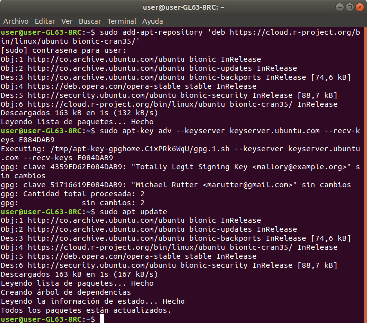
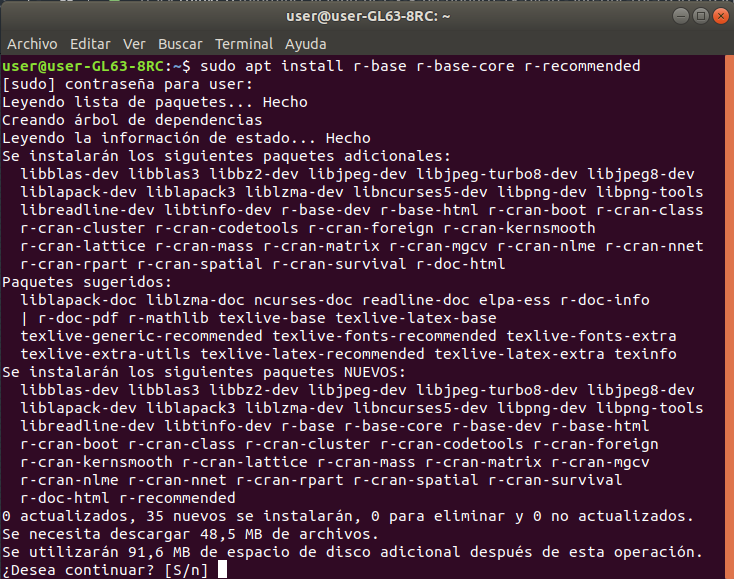
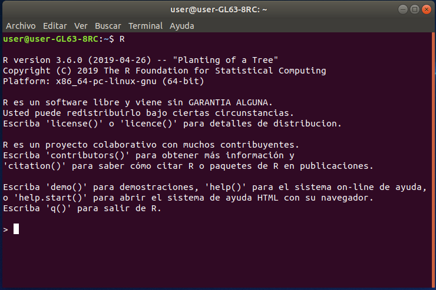
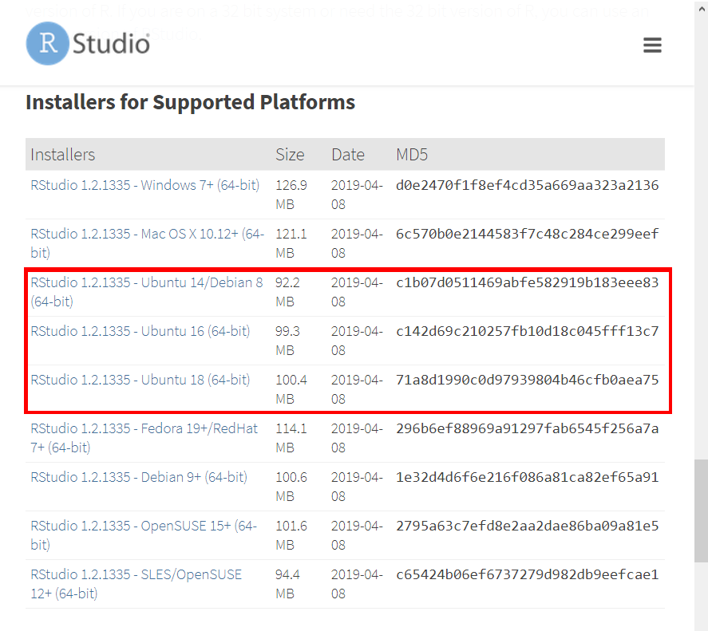
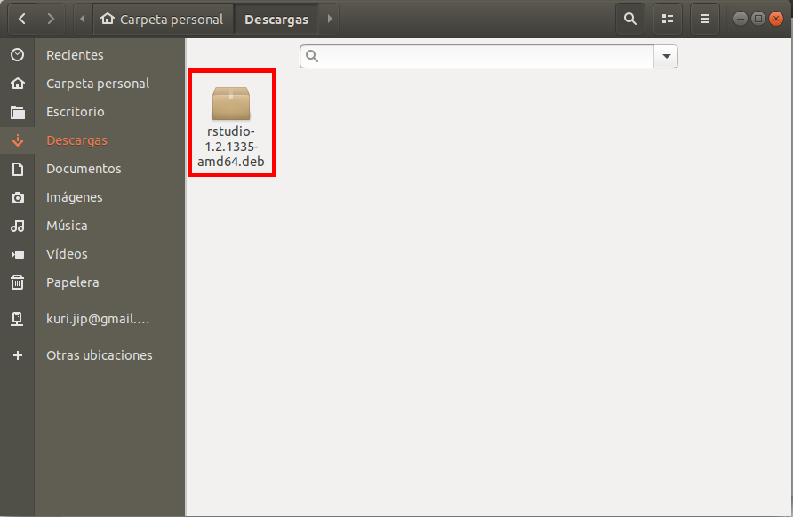
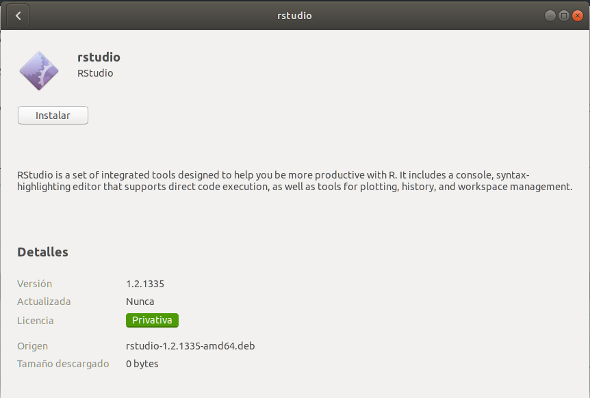
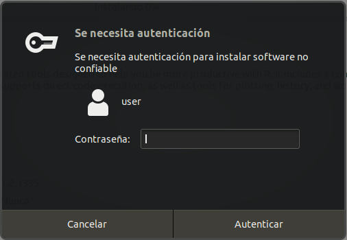
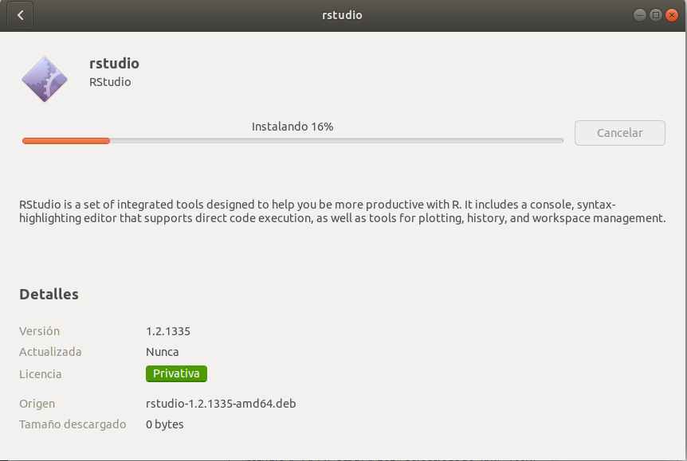

Instalación del programa R
--------------------------

Para la descarga de la última versión del programa R-project en Ubuntu,
es necesario abrir una terminal, y escribir en ésta, las siguientes
lineas de código

    sudo add-apt-repository 'deb https://cloud.r-project.org/bin/linux/ubuntu bionic-cran35/'
    sudo apt-key adv --keyserver keyserver.ubuntu.com --recv-keys E084DAB9
    sudo apt update

en caso de tener problemas con la segunda linea de código, probar con

    sudo apt-key adv --keyserver hkp://keyserver.ubuntu.com:80 --recv-keys E084DAB9

una vez terminada la actualización, se escribe en la terminal la
siguiente línea de código

    sudo apt install r-base r-base-core r-recommended

Cuando se le pregunte si desea continuar, escriba la tecla S, presione
la tecla Enter y espere hasta que termine la instalación. Para iniciar
el programa <tt>R-project</tt>, abra una terminal y escriba la siguiente
linea de código

    R

Instalación RStudio
-------------------

Para la descarga de la última versión del programa Rstudio, haga click
en el siguiente enlace [(Descargar
RStudio)](https://www.rstudio.com/products/rstudio/download/#download){:target="\_blank"}.

Una vez realizado click en el enlace, se abrirá la siguiente venta

Haga click sobre la versión de Rstudio que sea compatible con su sistema
operativo para que comience la descarga.

Una vez completada la descarga, vaya a la carpeta de descargas y haga
doble click sobre el instalador para que ésta inicie

En la ventana emergente, presione el botón de Instalar para que inicie
la descarga

Esto generará una ventana de autenticación, ingrese la contraseña del
usuario correspondiente a la sección en donde va a realizar la
instalación

Luego de ésto, comenzará la instalación, espere a que el proceso termine
y con ésto concluirá la instalación del programa.
